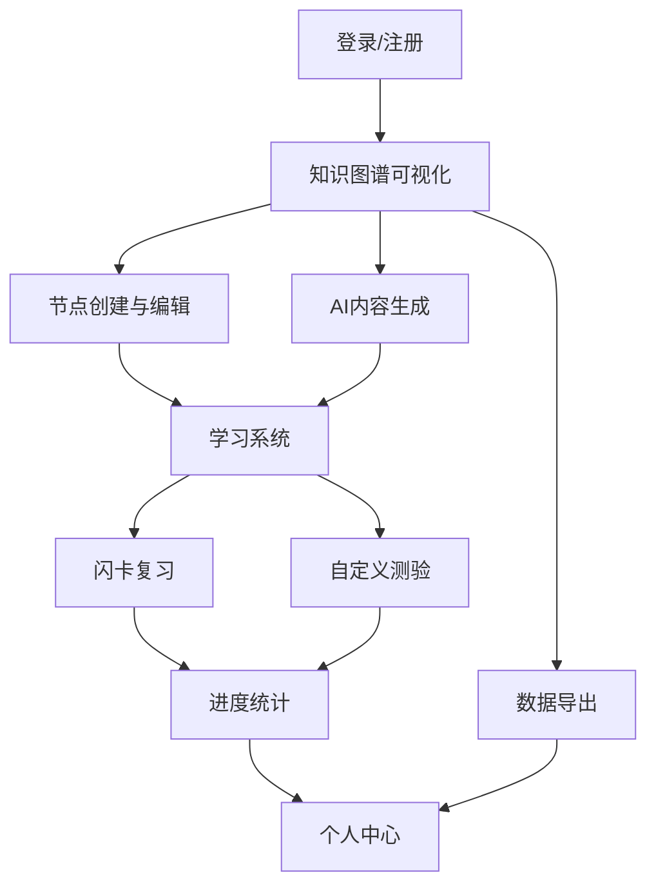

## 1. 产品概述
知识图谱构建与学习软件是一款集知识可视化、AI辅助生成、学习记忆强化于一体的综合知识管理平台。帮助用户高效构建个人知识体系，通过智能化工具提升学习效果和知识管理效率。

目标用户包括学生、研究人员、知识工作者等需要系统化管理知识的个人和团队，市场价值在于解决传统知识管理碎片化、学习效率低下的痛点。

## 2. 核心功能

### 2.1 用户角色
| 角色 | 注册方式 | 核心权限 |
|------|----------|----------|
| 普通用户 | 邮箱注册 | 创建个人知识图谱、使用基础学习功能 |
| 高级用户 | 订阅升级 | 无限制节点创建、高级AI功能、数据导出 |

### 2.2 功能模块
本软件包含以下核心页面：
1. **知识图谱可视化页面**：网状图展示、节点编辑、关系管理、多维度浏览。
2. **学习系统页面**：闪卡复习、自定义测验、进度跟踪、记忆曲线。
3. **数据管理页面**：导入导出、文档编辑、同步管理、格式转换。
4. **个人中心页面**：偏好设置、统计分析、账户管理、样式定制。

### 2.3 页面详情
| 页面名称 | 模块名称 | 功能描述 |
|----------|----------|----------|
| 知识图谱可视化 | 图谱展示 | 拖拽式网状图渲染、节点缩放、关系连线显示、多层级展开收缩 |
| 知识图谱可视化 | 节点管理 | 创建/编辑/删除节点、设置节点属性、添加节点描述和标签 |
| 知识图谱可视化 | 关系编辑 | 建立节点连接、设置关系类型和权重、删除关联关系 |
| 知识图谱可视化 | AI辅助 | 自动生成节点内容、联网搜索参考资料、智能扩展知识点 |
| 学习系统 | 闪卡复习 | 基于遗忘曲线的复习提醒、卡片翻转动画、掌握程度标记 |
| 学习系统 | 测验创建 | 自定义题目和答案、设置测验规则、随机题目生成 |
| 学习系统 | 进度跟踪 | 学习时长统计、知识点掌握度、个人学习报告生成 |
| 数据管理 | 导入导出 | 支持JSON/PDF格式导出、批量数据导入、子图谱选择性导出 |
| 数据管理 | 文档编辑 | 富文本编辑器、实时同步数据库、版本历史管理 |
| 个人中心 | 个性化设置 | 图谱颜色主题、节点样式自定义、界面布局调整 |
| 个人中心 | 统计分析 | 学习数据可视化、知识图谱复杂度分析、使用行为统计 |

## 3. 核心流程
用户首次使用需完成注册登录，进入主界面后可创建新的知识图谱或导入现有数据。在图谱可视化界面，用户可通过拖拽创建节点，建立节点间关系，使用AI功能自动生成内容。学习阶段可选择特定知识点生成闪卡，系统根据记忆曲线推送复习任务。数据可随时导出备份，支持多格式转换。

## 4. 用户界面设计

### 4.1 设计风格
- 主色调：深蓝色(#1E3A8A)搭配白色背景，强调色为橙色(#F97316)
- 按钮样式：圆角矩形设计，主要操作按钮使用渐变色
- 字体：中文使用思源黑体，英文使用Inter，正文字号14px，标题18px
- 布局风格：左侧导航栏+主内容区域，卡片式信息展示
- 图标风格：使用线性图标，保持简洁现代风格

### 4.2 页面设计概览
| 页面名称 | 模块名称 | UI元素 |
|----------|----------|--------|
| 知识图谱可视化 | 图谱区域 | 全屏画布、深色背景、彩色节点、动态连线动画 |
| 知识图谱可视化 | 工具栏 | 顶部悬浮工具条、图标按钮分组、右键上下文菜单 |
| 学习系统 | 闪卡界面 | 卡片翻转3D效果、进度条显示、操作按钮底部布局 |
| 学习系统 | 测验界面 | 题目卡片居中、选项按钮垂直排列、计时器顶部显示 |
| 数据管理 | 文件列表 | 表格形式展示、操作按钮悬浮显示、拖拽上传区域 |
| 个人中心 | 统计图表 | 彩色饼图和柱状图、数据卡片网格布局、趋势曲线图 |

### 4.3 响应式设计
采用桌面端优先设计，支持1920×1080及以上分辨率。平板端自适应布局，移动端简化功能保留核心操作。触控优化包括：增大点击区域、支持手势缩放、长按激活编辑模式。

### 4.4 3D场景指导
知识图谱可视化采用Three.js实现3D效果：
- 环境：使用科技感的深色空间背景，添加粒子效果增强视觉层次
- 光照：设置环境光和方向光组合，节点使用发光材质突出显示
- 相机：采用透视相机，支持鼠标控制视角旋转和缩放
- 交互：节点悬停高亮、点击展开详情、拖拽重新布局
- 性能：限制同时渲染节点数量，使用LOD技术优化大规模图谱显示