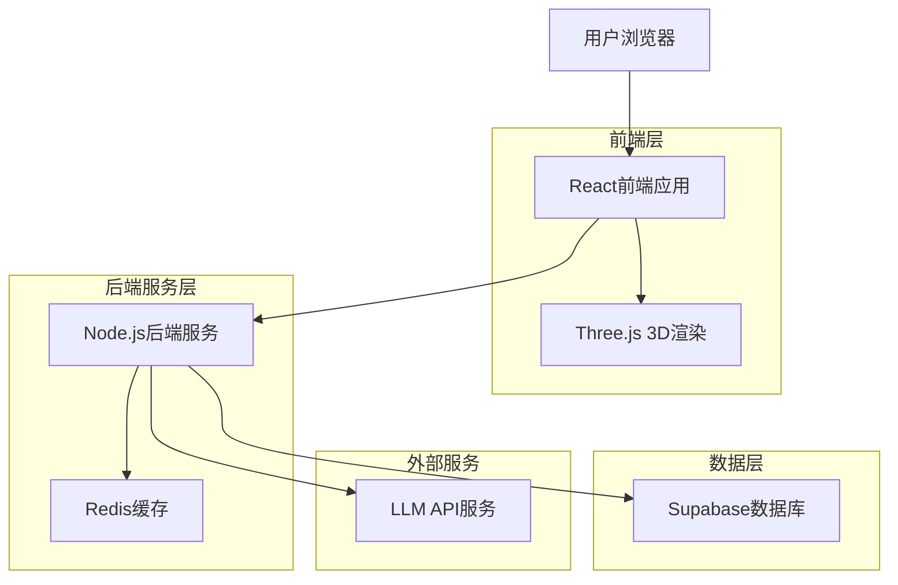
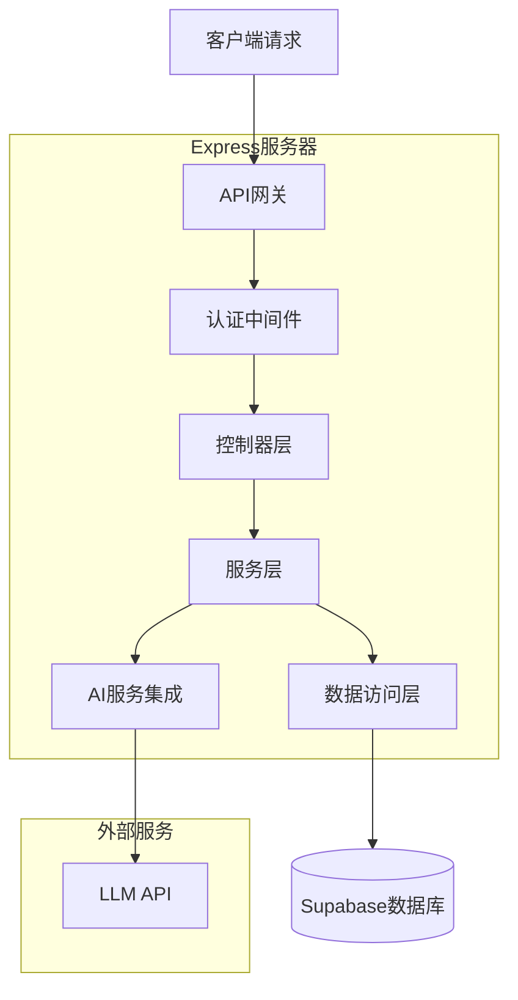
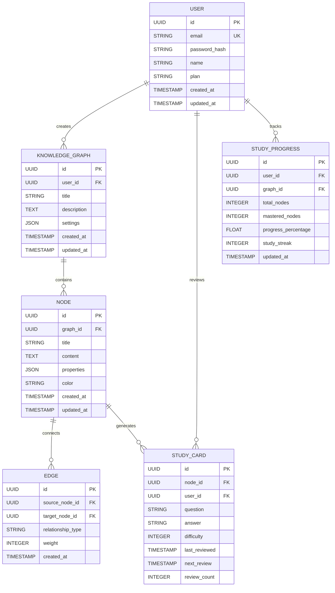

## 1. 架构设计



## 2. 技术描述

- 前端：React@18 + TypeScript + TailwindCSS@3 + Vite
- 初始化工具：vite-init
- 后端：Node.js@20 + Express@4
- 数据库：Supabase (PostgreSQL)
- 3D渲染：Three.js + @react-three/fiber
- 状态管理：Zustand
- 图表库：Chart.js + Mermaid
- 富文本编辑器：Quill.js

## 3. 路由定义

| 路由 | 用途 |
|------|------|
| / | 登录页面，用户身份验证 |
| /dashboard | 主控制台，知识图谱总览 |
| /graph/:id | 知识图谱可视化编辑页面 |
| /study/:graphId | 学习系统，闪卡和测验 |
| /data | 数据管理，导入导出功能 |
| /profile | 个人中心，设置和统计 |
| /ai-assistant | AI辅助内容生成页面 |

## 4. API定义

### 4.1 用户认证API
```
POST /api/auth/login
POST /api/auth/register
POST /api/auth/logout
GET  /api/auth/user
```

### 4.2 知识图谱API
```
GET    /api/graphs
POST   /api/graphs
PUT    /api/graphs/:id
DELETE /api/graphs/:id
GET    /api/graphs/:id/nodes
POST   /api/nodes
PUT    /api/nodes/:id
DELETE /api/nodes/:id
POST   /api/edges
DELETE /api/edges/:id
```

### 4.3 AI辅助API
```
POST /api/ai/generate-content
POST /api/ai/search-references
POST /api/ai/expand-knowledge
```

### 4.4 学习系统API
```
GET    /api/study/cards
POST   /api/study/cards
PUT    /api/study/cards/:id/progress
GET    /api/study/quizzes
POST   /api/study/quizzes
POST   /api/study/quizzes/:id/submit
GET    /api/study/progress
```

### 4.5 数据管理API
```
GET  /api/data/export/:format
POST /api/data/import
GET  /api/data/templates
```

## 5. 服务器架构图



## 6. 数据模型

### 6.1 数据模型定义


### 6.2 数据定义语言

用户表 (users)
```sql
CREATE TABLE users (
  id UUID PRIMARY KEY DEFAULT gen_random_uuid(),
  email VARCHAR(255) UNIQUE NOT NULL,
  password_hash VARCHAR(255) NOT NULL,
  name VARCHAR(100) NOT NULL,
  plan VARCHAR(20) DEFAULT 'free' CHECK (plan IN ('free', 'premium')),
  created_at TIMESTAMP WITH TIME ZONE DEFAULT NOW(),
  updated_at TIMESTAMP WITH TIME ZONE DEFAULT NOW()
);

-- 权限设置
GRANT SELECT ON users TO anon;
GRANT ALL PRIVILEGES ON users TO authenticated;
```

知识图谱表 (knowledge_graphs)
```sql
CREATE TABLE knowledge_graphs (
  id UUID PRIMARY KEY DEFAULT gen_random_uuid(),
  user_id UUID REFERENCES users(id) ON DELETE CASCADE,
  title VARCHAR(255) NOT NULL,
  description TEXT,
  settings JSONB DEFAULT '{}',
  created_at TIMESTAMP WITH TIME ZONE DEFAULT NOW(),
  updated_at TIMESTAMP WITH TIME ZONE DEFAULT NOW()
);

CREATE INDEX idx_knowledge_graphs_user_id ON knowledge_graphs(user_id);
GRANT SELECT ON knowledge_graphs TO anon;
GRANT ALL PRIVILEGES ON knowledge_graphs TO authenticated;
```

节点表 (nodes)
```sql
CREATE TABLE nodes (
  id UUID PRIMARY KEY DEFAULT gen_random_uuid(),
  graph_id UUID REFERENCES knowledge_graphs(id) ON DELETE CASCADE,
  title VARCHAR(255) NOT NULL,
  content TEXT,
  properties JSONB DEFAULT '{}',
  color VARCHAR(7) DEFAULT '#3B82F6',
  x_position INTEGER DEFAULT 0,
  y_position INTEGER DEFAULT 0,
  created_at TIMESTAMP WITH TIME ZONE DEFAULT NOW(),
  updated_at TIMESTAMP WITH TIME ZONE DEFAULT NOW()
);

CREATE INDEX idx_nodes_graph_id ON nodes(graph_id);
GRANT SELECT ON nodes TO anon;
GRANT ALL PRIVILEGES ON nodes TO authenticated;
```

边关系表 (edges)
```sql
CREATE TABLE edges (
  id UUID PRIMARY KEY DEFAULT gen_random_uuid(),
  source_node_id UUID REFERENCES nodes(id) ON DELETE CASCADE,
  target_node_id UUID REFERENCES nodes(id) ON DELETE CASCADE,
  relationship_type VARCHAR(50) DEFAULT 'related',
  weight INTEGER DEFAULT 1,
  created_at TIMESTAMP WITH TIME ZONE DEFAULT NOW(),
  UNIQUE(source_node_id, target_node_id, relationship_type)
);

CREATE INDEX idx_edges_source ON edges(source_node_id);
CREATE INDEX idx_edges_target ON edges(target_node_id);
GRANT SELECT ON edges TO anon;
GRANT ALL PRIVILEGES ON edges TO authenticated;
```

学习卡片表 (study_cards)
```sql
CREATE TABLE study_cards (
  id UUID PRIMARY KEY DEFAULT gen_random_uuid(),
  node_id UUID REFERENCES nodes(id) ON DELETE CASCADE,
  user_id UUID REFERENCES users(id) ON DELETE CASCADE,
  question TEXT NOT NULL,
  answer TEXT NOT NULL,
  difficulty INTEGER DEFAULT 1 CHECK (difficulty BETWEEN 1 AND 5),
  last_reviewed TIMESTAMP WITH TIME ZONE,
  next_review TIMESTAMP WITH TIME ZONE DEFAULT NOW(),
  review_count INTEGER DEFAULT 0,
  created_at TIMESTAMP WITH TIME ZONE DEFAULT NOW()
);

CREATE INDEX idx_study_cards_user_next_review ON study_cards(user_id, next_review);
GRANT SELECT ON study_cards TO anon;
GRANT ALL PRIVILEGES ON study_cards TO authenticated;
```

学习进度表 (study_progress)
```sql
CREATE TABLE study_progress (
  id UUID PRIMARY KEY DEFAULT gen_random_uuid(),
  user_id UUID REFERENCES users(id) ON DELETE CASCADE,
  graph_id UUID REFERENCES knowledge_graphs(id) ON DELETE CASCADE,
  total_nodes INTEGER DEFAULT 0,
  mastered_nodes INTEGER DEFAULT 0,
  progress_percentage FLOAT DEFAULT 0,
  study_streak INTEGER DEFAULT 0,
  updated_at TIMESTAMP WITH TIME ZONE DEFAULT NOW(),
  UNIQUE(user_id, graph_id)
);

CREATE INDEX idx_study_progress_user ON study_progress(user_id);
GRANT SELECT ON study_progress TO anon;
GRANT ALL PRIVILEGES ON study_progress TO authenticated;
```