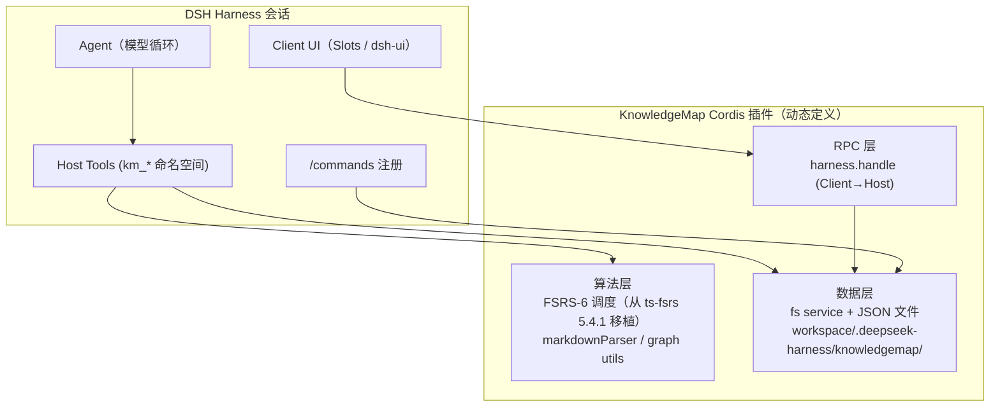

# KnowledgeMap × DSH Harness 集成设计

> 目标：把 KnowledgeMap 的核心能力（FSRS 间隔重复、知识图谱、任务调度、成就系统）整合为 DeepSeek Harness（DSH）的 Cordis 插件，让用户在对话式 agent 会话里直接使用这些能力。
>
> 状态：**✅ 12 个 Phase 全部交付** · 方案定稿于 2026-08-16 · 本文件同时作为路线图进度账本维护

---

## 1. 为什么整合 / 整合什么

KnowledgeMap 是一个「知识管理 + 学习」全栈应用（Electron + Web + Android）。DSH 是 agent 运行时。两者互补：

| KnowledgeMap 能力 | 在 harness 会话中的价值 | 整合形态 |
| --- | --- | --- |
| **FSRS 间隔重复**（ts-fsrs，纯算法） | 把对话中沉淀的知识点做成闪卡，按遗忘曲线安排复习 | Host 工具 `km_review*` + JSON 持久化（**Phase 1**） |
| **知识图谱**（shared/types/graph-*） | 把项目/领域知识组织成节点-边，生成 mermaid 可视化 | Host 工具 `km_graph*` + dsh-ui mermaid/scene3d 渲染（**Phase 2**） |
| **任务调度**（Q0/Q1/Q2 三层队列） | 把待办拆成三级队列，结合 timer 番茄钟 | Host 工具 `km_task*` + timer service + 面板（**Phase 3**） |
| **成就/经验系统**（shared/types/scheduler-achievement） | 把复习/任务做成游戏化反馈 | 轻量 badge/stat 组件（**Phase 4**） |
| **命令控制台**（src/services/console/CommandRegistry） | 把内部命令映射为 harness `/commands` | `commands` service 注册（**Phase 4**） |
| **AI 助教 / RAG** | harness 已有 llm service，可复用其流式能力 | 视需要接入（**Phase 5**，低优先） |

**不做**：不移植整个 React 前端、不依赖 Supabase 账号体系、不要求用户运行 KnowledgeMap 后端。插件是**自包含、离线可用**的：纯算法内嵌，数据落在 workspace 的 JSON 文件里。

---

## 2. 架构总览



**分层职责**（与 DSH 插件开发规范一致）：

1. **数据层**：`fs` service（`resolve` + `stat` + `readText` + `writeText`），文件统一放在 `<workspaceRoot>/.deepseek-harness/knowledgemap/` 下，按域分文件：`cards.json`、`graphs.json`、`tasks.json`、`progress.json`。写操作保持原子（整体 JSON 重写），读操作全量加载（数据量小，后续再优化为分片）。
2. **算法层**：纯 JS 移植，**零运行时依赖**（动态插件无法 import）。FSRS-6 的 `next_state` / `next_interval` / 学习步进逻辑从 ts-fsrs 5.4.1 的 `dist/index.mjs` 忠实移植（默认 21 参数 w、request_retention=0.9、learning_steps=["1m","10m"]）。
3. **工具层**：`harness.defineTool` + `harness.registerTool(ctx, def)`，工具名统一 `km_` 前缀，参数/输出走 `ParameterSchemaSpec` / `ValueSchemaSpec` DSL，`execute` 内捕获 `ctx` 闭包访问算法与存储。
4. **UI 层（后续 Phase）**：Client 侧用 `host.call` 调 Host 的 `harness.handle` 方法，注册到合适的 Slot（如 `tool.view.cordis` / `conversation.chat.turnTail`），配合 dsh-ui 的 quiz/stat/chart 组件做复习界面与知识图谱可视化。
5. **命令层（后续 Phase）**：`commands` service 注册 `/km` 系列人类命令，复用 KnowledgeMap 的 CommandRegistry 解析思路。

---

## 3. 数据模型（与 KnowledgeMap 对齐）

### 3.1 闪卡（Phase 1）

```jsonc
// .deepseek-harness/knowledgemap/cards.json
{
  "version": 1,
  "decks": { "general": { "name": "默认牌组", "created_at": "..." } },
  "cards": [
    {
      "id": "c_...",
      "deck": "general",
      "front": "问题",
      "back": "答案",
      "tags": ["fsrs", "algorithm"],
      "card_type": "qa",                    // 对齐 shared/types/common.ts StudyCard
      "state": 0,                           // 0 New / 1 Learning / 2 Review / 3 Relearning
      "stability": 0,
      "difficulty": 0,
      "elapsed_days": 0,
      "scheduled_days": 0,
      "reps": 0,
      "lapses": 0,
      "learning_steps": 0,
      "due": 1755360000000,                 // epoch ms
      "last_review": null,
      "created_at": 1755360000000,
      "history": [ { "rating": 3, "at": 1755360000000, "interval": 4 } ]
    }
  ]
}
```

字段名与 ts-fsrs `Card` 及 KnowledgeMap `StudyCard` 的 fsrs_* 列一一对应，未来若接入真实 SQLite 可直接映射。

### 3.2 知识图谱（Phase 2 草案）

对齐 `shared/types/graph-node.ts` / `graph-edge.ts` / `graph.ts`：节点（id、title、content、type/level、position、tags）+ 边（source、target、relation_type、weight）+ 图谱元信息（title、description、layout）。导出时转换为 mermaid `graph TD` 供 dsh-ui 渲染。

---

## 4. 路线图

### UI 改造（✅ 已交付 — durable web-profile 包）
目标：把 KnowledgeMap UI 从「run card 内嵌仪表盘」升级为「产品级 Slot 常驻融合」。

> **实现方式（重要）**：v2 不再用动态插件（Client half 需要用户批准，本会话 approval=never 时无法激活），
> 改为 **durable web-profile 真实包 `@knowledgemap/dsh-km-ui`**：
> - 源码：`.deepseek-harness/knowledgemap/km-ui/`（package.json `dsh.client` + `dsh.bundle.patch`）
> - 安装：`~/.dsh/profiles/web/node_modules/@knowledgemap/dsh-km-ui/`（hoisted node-linker，真实目录即可解析）
> - 注册：web profile `package.json` 的 `dsh.profile.bundles` 加入包名（重启后 bundle 层生效）
>   + `cordis.patch.yml` insert 行（`id: km-ui`，patch watcher **热生效**，无需重启）
> - Host 半区：`lib/index.js` 注册 `/km-ui-overview`、`/km-ui-queue [limit]` 两个命令（`commands` remote，`recordInput: false`），
>   从调用方会话 `invocation.agent.session.header.cwd` 读六域 JSON，结果以 JSON 字符串放 `text`
> - Client 半区：`lib/client.js` 走 `window.__ModuleLoader__.load`，`ctx.remote.commands.execute` 调 RPC，
>   React 用 `require("react")`，CSS 手动注入 `<style data-plugin>`
>
> 注：目录中另有 `plugin-ui2-host.js`（UI 改造 v2 的动态插件版备份，未单独建 Phase 条目）；两条载体的实际激活状态以 DSH web profile 的 `dsh.profile.bundles` / `cordis.patch.yml` 配置为准。

| Slot | 形态 | 作用 |
| --- | --- | --- |
| `conversation.composer.dock` | 常驻环境状态带 | 复习待办 / 图谱 / 任务 / 等级·连击 一行可见；点击展开复习队列 |
| `conversation.input.right` | 输入栏 🧠 按钮 | 快速展开/收起复习队列 |
| `conversation.session.header.utilities` | 会话头部 📊 按钮 | 打开六域总览浮层（session 作用域，负责捕获 sessionId） |
| `shell.overlay` | 总览面板 | 六域聚合（root 作用域无 sessionId，由 📊 按钮 toggle 时捕获传入） |
| `tool.view.cordis` | run card 卡片（保留） | 旧版仪表盘（kmapui-6）继续可用，与新融合 UI 互补 |

数据源：Host 命令（`commands` remote）读六域 JSON；Client 用 React.createElement + 模块级共享状态 + 主题 CSS 变量。
已验证：loader entry 有 fiber、两命令注册且端到端执行（六域数值与 JSON 数据一致）、client bundle 200、
boot manifest 含 `@knowledgemap/dsh-km-ui` 条目。**页面刷新后**四 Slot 生效。

### Phase 1 — FSRS 间隔重复闪卡（当前 ✅）
- [x] 调研：KnowledgeMap 模块、ts-fsrs 算法、DSH 工具/存储契约
- [x] 设计文档（本文件）
- [x] 插件 `kmap-1/pkg-7`：`km_card_add` / `km_card_list` / `km_review_queue` / `km_review_rate` / `km_review_stats`
- [x] JSON 持久化（会话 cwd + 会话级 sandboxPolicy 写授权，缺文件自动建）
- [x] 端到端验证：加卡 → 复习 → 评分 → 重排 → 统计（FSRS-6 数值与 ts-fsrs 5.4.1 逐项核对一致）
- [x] 源码落盘：`.deepseek-harness/knowledgemap/plugin-host.js`（可重定义）

> **Phase 1 经验沉淀**（写入插件时的重要坑）：
> 1. `output.render(args, value)` —— 第二个参数才是结果，第一个是入参（曾把入参当结果渲染）。
> 2. 动态插件持久化必须解析**会话 cwd**（`exec.agent.session.header.cwd`），`sandboxPolicy.workspaceRoot` 是 fallback（可能是用户主目录）。
> 3. 写文件必须显式传会话级策略：`sandboxPolicy.resolve({ session })` 给 `fs.writeText` 的 `sandboxPolicy` 参数，否则按部署默认模式拒绝写工作区。
> 4. 无内存缓存、每次从磁盘重读，支持人工编辑 JSON。

### Phase 2 — 知识图谱工具集（✅）
- [x] 插件 `kmapg-2/pkg-8`：`km_graph_create` / `km_graph_node_add` / `km_graph_link` / `km_graph_list` / `km_graph_export`（mermaid/JSON）/ `km_graph_search`
- [x] 字段对齐 `shared/types/graph-*`（NodeLevel、GraphRelationType、Edge.weight/custom_label）
- [x] mermaid 导出（节点/边标签转义）+ JSON 导出，可直接喂给 dsh-ui mermaid 组件渲染
- [x] 边校验（source/target 必须在图内、不可自环）+ 端到端验证（建图→4 节点→3 边→导出→搜索）
- [x] 源码落盘：`.deepseek-harness/knowledgemap/plugin-graph-host.js`

### Phase 3 — 任务调度（✅）
- [x] 插件 `kmapt-3/pkg-9`：`km_task_add` / `km_task_list` / `km_task_start` / `km_task_focus_end` / `km_task_complete` / `km_task_stats`
- [x] Q0/Q1/Q2 三级队列 + 番茄钟 focus session 追踪（累计实际专注时长）
- [x] 队列/状态/标签筛选、时间片设置（Q0 25m / Q1 45m / Q2 60m / 休息 5m）、完成率/今日完成统计
- [x] 防护：已运行番茄钟时拒绝重复 start；completed 任务不可再 start
- [x] 字段对齐 `shared/types/scheduler-*`（UserTaskStatus、TaskType、queue_level）
- [x] 源码落盘：`.deepseek-harness/knowledgemap/plugin-task-host.js`

### Phase 4 — 游戏化 & 命令入口（✅）
- [x] 插件 `kmapp-4/pkg-10`：`km_progress_get` / `km_progress_earn` / `km_achievement_list`
- [x] XP 曲线对齐 `api/services/achievements/achievementEngine.ts`：nextLevelThreshold = level × 500（升级扣减、溢出结转）——已数值验证（440+100 → Lv.2 @40XP）
- [x] 12 个成就（study/focus/tasks/streak/creation/special 六类），解锁时自动发 XP；连击按自然日累计
- [x] XP 单价对齐 KnowledgeMap 每日任务奖励（review 5/张、focus 2/分钟、task 10/个、graph 30/个、node 30/个、login 20）
- [x] `/km` 命令入口（commands service 注册，返回进度总览文本）
- [x] 字段对齐 `shared/types/scheduler-achievement.ts`（Achievement 六类 + xp_reward）
- [x] 源码落盘：`.deepseek-harness/knowledgemap/plugin-progress-host.js`

### Phase 5 — 深度集成（✅ 核心层）
- [x] 插件 `kmhub-5/pkg-11`：`km_retrieve`（跨域 RAG 检索）/ `km_export`（全量备份包）/ `km_dashboard`（四域总览）
- [x] `km_retrieve` 跨 cards/graphs/tasks 关键词检索，带来源（deck/graph_title）与状态，供模型作答引用
- [x] `km_export` 单文件备份包（study_cards/graphs/nodes/edges/tasks/progress），可落盘 export-YYYY-MM-DD.json
- [x] `km_dashboard` 复习队列/图谱/任务/进度四域聚合，一屏掌握全局
- [x] 源码落盘：`.deepseek-harness/knowledgemap/plugin-hub-host.js`
- [ ] 待评估（后续按需）：Electron better-sqlite3 本地库桥（当前无本地库文件，数据在 Supabase 云端）；基于 harness `llm` service 的语义 RAG

### Phase 6 — Client UI 面板（✅ 已激活）
- [x] 插件 `kmapui-6/pkg-12`：Host `harness.handle('km-dashboard-data')` RPC + Client `tool.view.cordis` (key:self) 仪表盘
- [x] **用户手动批准后已激活**（run-13）：slot `tool.view.cordis` occupant = `dyn/kmapui-6`（active），run card 内内嵌可刷新仪表盘
- [x] Host RPC 通过 `sessions` service 解析调用方会话 cwd，读取四域 JSON 聚合
- [x] 会话内替代同样可用：`km_dashboard` 工具 + `render_ui` 工具卡（已演示）
- [x] 源码落盘：`.deepseek-harness/knowledgemap/plugin-dashboard.js`

### Phase 7 — 持久化打包（✅ 已挂载）
- [x] 真实 npm 包 `@knowledgemap/dsh-km`（`~/.dsh/profiles/node_modules/@knowledgemap/dsh-km/`）：23 个 km_* 工具 + `/km` 命令，从动态插件移植为 ESM 真实插件（`defineTool` + `ctx.get('tools')`，零 inject 依赖）
- [x] 用户 preset `knowledgemap`（`~/.dsh/.agent-presets/knowledgemap/`，copy 自 standard + 追加 `km-tools` 行）——**重启后自动加载**，无需再手动 cordis_run
- [x] **mount 验证通过**（standingKeyFor → "mounted OK"）：工具注册、包解析、realm 规则全部正确
- [x] 数据不重复：与动态插件共用 `<会话 cwd>/.deepseek-harness/knowledgemap/*.json`（cards/graphs/tasks/progress）
- [x] 经验：loader 内部按 specifier 缓存模块——改名（dsh-km-tools→dsh-km）后绕过陈旧缓存；preset 内只注册工具的包无需 realm（与 tool-fs 同理）
- [ ] 待用户操作：新建会话时选择 preset **knowledgemap**，即获得完整 KnowledgeMap 工具集

### Phase 8 — 语义 RAG（✅）
- [x] 动态插件 `kmrag-10/pkg-16`：`km_ask`（检索 + `llm.stream` 合成答案）/ `km_ask_sources`（纯检索预览）
- [x] 检索：跨 cards/graphs/tasks **中英分词**（英文按词、中文按 bigram，修复无空格中文整句漏检），组装带来源上下文
- [x] 合成：`agentDefaultModel.currentSelection()` 取当前模型路由 → `llm.stream` → 聚合 text-delta；llm 不可用/无路由时优雅降级
- [x] 端到端验证（中英文各一轮）：FSRS 公式、本地数据库方案均命中并输出正确带依据答案（used_llm=true, deepseek-v4-flash）
- [x] 同步加入持久化包 `@knowledgemap/dsh-km`（25 工具 + /km，smoke 通过；重启后生效）
- [x] 源码落盘：`.deepseek-harness/knowledgemap/plugin-rag-host.js`

### Phase 9 — 学习路径（✅）
- [x] 动态插件 `kmpath-11/pkg-17`：`km_path_create` / `km_path_node_add` / `km_path_list` / `km_path_node_start` / `km_path_node_complete` / `km_path_stats`
- [x] 把图谱节点编排成「目标 → 节点序列 → 进度」：节点标题从 graphs.json 自动解析、完成节点自动更新百分比、全部完成自动置 completed
- [x] 字段对齐 `shared/types/common.ts`（LearningPath / LearningPathNodeRef / 状态枚举）
- [x] 端到端验证：建路径 → 挂 3 节点（FSRS/图谱/任务）→ 开始 → 逐一完成 → 33%→67%→100% 自动 completed
- [x] 同步加入持久化包 `@knowledgemap/dsh-km`（**31 工具** + /km，smoke 通过；重启后生效）
- [x] 源码落盘：`.deepseek-harness/knowledgemap/plugin-path-host.js`

### Phase 10 — 笔记系统（✅）
- [x] 动态插件 `kmnote-12/pkg-18`：`km_note_add` / `km_note_list` / `km_note_get` / `km_note_link` / `km_note_backlinks` / `km_note_stats`
- [x] `[[节点标题]]` wiki 链接自动解析为图谱节点挂载（别名匹配）；笔记间 `[[标题]]` 互相引用形成反链
- [x] 字段对齐 `shared/types/note.ts`（Note / NoteNodeLink / note|daily）
- [x] 端到端验证：建 2 笔记 → 自动挂载 4 个图谱节点（FSRS/图谱/任务/成就）→ 反链 1（补充笔记→决策记录）
- [x] 同步加入持久化包 `@knowledgemap/dsh-km`（**37 工具** + /km，smoke 通过；重启后生效）
- [x] 源码落盘：`.deepseek-harness/knowledgemap/plugin-note-host.js`

### Phase 11 — 统一 Hub v2（✅ 六域全覆盖）
- [x] 动态插件 `kmhub-13/pkg-19`（替换 kmhub-5）：`km_retrieve` / `km_export` / `km_dashboard` 全部升级为 **6 域**（cards + graphs/nodes/edges + tasks + progress + paths + notes）
- [x] `km_retrieve` 跨五域检索（闪卡/节点/任务/笔记/路径），笔记返回 wiki_links
- [x] `km_export` format_version=2：备份包新增 learning_paths / notes / note_node_links
- [x] `km_dashboard` 六域聚合（新增 paths 总数/进行中/平均进度、notes 总数/挂载数）
- [x] 端到端验证：dashboard 六域齐全、检索「FSRS」命中卡+节点+笔记、导出含路径与笔记
- [x] 同步加入持久化包 `@knowledgemap/dsh-km`（37 工具 + /km，smoke 通过；重启后生效）
- [x] 源码落盘：`.deepseek-harness/knowledgemap/plugin-hub2-host.js`

### Phase 12 — Client UI 内联复习（✅ 源码就绪）
- [x] 插件 `kmapui-7`（取代 kmapui-6）：Host RPC `km-review-start` / `km-review-rate`（`km-dashboard-data` 原样保留）
- [x] 复习闭环内联：出题 → 显示答案 → 四档评分 → FSRS-6 重排 → 自动下一张 → 结束总结（张数/分布/XP/升级/成就）
- [x] 评分同步结算 progress（+5 XP/张、连击、counters.reviews、level×500、12 成就解锁补发），与 km_progress_earn 语义一致
- [x] 空队列显示下一张到期时间；RPC 失败内联报错不白屏；评分防重复提交
- [x] FSRS-6 / 成就块从 plugin-host.js / plugin-progress-host.js 逐字符移植（diff 零漂移）
- [x] 源码落盘：`.deepseek-harness/knowledgemap/plugin-review-ui.js`
- [ ] ~~待用户操作：DSH 会话内 `cordis_stop` kmapui-6 后 `cordis_define` + `cordis_run` kmapui-7~~（已由上述 durable 包 `@knowledgemap/dsh-km-ui` 承接；本动态版保留为备用路径，激活需 Client half 手动审批）

> **现状**：10 动态插件 · 37 工具运行中（kmapui-7 取代 kmapui-6 计入）+ 持久化 preset（重启后自动加载 37 工具）+ Client UI 已激活（durable 包 `@knowledgemap/dsh-km-ui` 四 Slot 融合 UI + 动态版备用）+ 使用指南（docs/harness-usage.md）；六域数据（cards/graphs/tasks/progress/paths/notes）全部可检索、可导出、可总览。

---

## 5. 技术要点与规范

- **动态插件生命周期**：`cordis_define`（不可变 Package）→ `cordis_run`（激活）→ 停用/更新走 `cordis_stop` / `cordis_run update`。所有副作用（工具注册、RPC handler、timer）必须挂到当前 Fiber，可被自动清理。
- **工具命名**：`km_` 前缀，避免与内置工具（`pwsh`、`read` 等）冲突；描述写中文+英文，便于模型理解。
- **存储原子性**：所有变更走「读全量 → 内存修改 → 整体写回」，不并发写；单文件小，可接受。
- **FSRS 忠实性**：算法参数与公式必须与 ts-fsrs 5.4.1 默认行为一致（`default_w` 21 参数、`computeDecayFactor`、`forgetting_curve`、`next_state` 分支、学习步进），避免与 KnowledgeMap 端数据漂移。已从 `node_modules/ts-fsrs/dist/index.mjs` 逐行核对。
- **可测试性**：Phase 1 工具全部无副作用依赖（除本地 JSON），可在会话内直接端到端验证。

## 6. 风险与决策记录

| 风险/决策 | 结论 |
| --- | --- |
| 动态插件重启后失效 | Phase 1 接受（会话内工具）；长期方案是把插件固化为 preset/composition 行，见 `editing-cordis-compositions` 技能 |
| 无 `import`/`require` | 算法层纯 JS 内嵌；不依赖任何 npm 包 |
| 数据只落 workspace | 有意为之：插件数据随项目走，可 git 忽略；不侵入 Supabase |
| 与 KnowledgeMap 本身的数据互通 | 先做 harness 内自洽的 JSON 域；Phase 5 再做 SQLite/Supabase 桥 |
